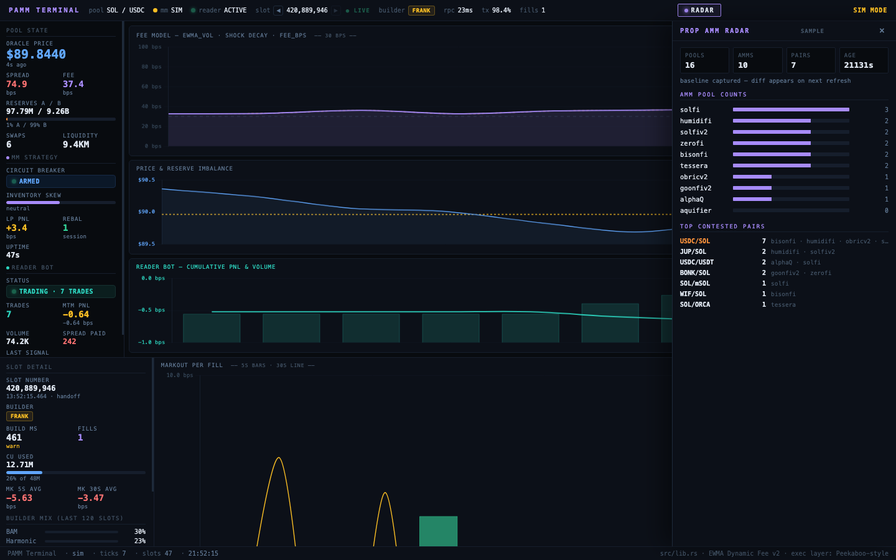

<!--
TITLES (pick one when publishing):
  · Blog/Twitter (recommended): I reverse-engineered Solana's last 2 unpublished prop AMMs. One of them was hiding a secret.
  · Gist / technical archive:   The (Almost) Complete Solana Prop-AMM Mint Dictionary

Strip this comment block before publishing.
-->

# I reverse-engineered Solana's last 2 unpublished prop AMMs. One of them was hiding a secret.

*Completing [mubarizkyc's prop-AMM offset table](https://gist.github.com/mubarizkyc/959ac9b33dae4f3a86c6e00c331a9901) — and discovering why one of the two missing entries was missing.*

> **TL;DR** — There are at least 10 closed-source proprietary AMMs (prop AMMs) live on Solana mainnet. mubarizkyc published byte offsets for 8 of them last year; the other two — humidifi and aquifier — were blank. **Aquifier** turned out to be a straightforward Anchor-style pool, reversed in 90 seconds with no API key. **Humidifi**, on the other hand, doesn't store mint pubkeys on chain *at all*. This post explains how I got the answers, why humidifi is different, and what falls out the other side.

## Why bother

Prop AMMs are where a lot of Solana's flow actually clears — quietly, off Jupiter's headline screen. HumidiFi alone hit [$8.55B weekly volume in late 2025](https://www.helius.dev/blog/solanas-proprietary-amm-revolution). If you're running a market-making bot, building an aggregator, or doing competitor intel, the first question is always: *which pairs are they trading right now?*

That question reduces to:

1. List the prop-AMM program IDs.
2. For each, call `getProgramAccounts` with a `dataSize` filter to enumerate pool accounts.
3. For each pool, decode the two mint pubkeys at known byte offsets.

Steps 1 and 3 are pure static knowledge. Once published, anyone can reuse them. The blank rows in the gist were the last gap.

## The 10 programs

| AMM       | Program ID                                        | Account size |
|-----------|---------------------------------------------------|-------------:|
| humidifi  | `9H6tua7jkLhdm3w8BvgpTn5LZNU7g4ZynDmCiNN3q6Rp`    | 1728 |
| solfi     | `SoLFiHG9TfgtdUXUjWAxi3LtvYuFyDLVhBWxdMZxyCe`     | 2800 |
| solfiv2   | `SV2EYYJyRz2YhfXwXnhNAevDEui5Q6yrfyo13WtupPF`     | 1728 |
| zerofi    | `ZERor4xhbUycZ6gb9ntrhqscUcZmAbQDjEAtCf4hbZY`     | 7456 |
| bisonfi   | `BiSoNHVpsVZW2F7rx2eQ59yQwKxzU5NvBcmKshCSUypi`    | 2048 |
| obricv2   | `obriQD1zbpyLz95G5n7nJe6a4DPjpFwa5XYPoNm113y`     |  666 |
| goonfiv2  | `goonuddtQRrWqqn5nFyczVKaie28f3kDkHWkHtURSLE`     | 2048 |
| aquifier  | `AQU1FRd7papthgdrwPTTq5JacJh8YtwEXaBfKU3bTz45`    | 1056 |
| alphaQ    | `ALPHAQmeA7bjrVuccPsYPiCvsi428SNwte66Srvs4pHA`    |  672 |
| tessera   | `TessVdML9pBGgG9yGks7o4HewRaXVAMuoVj4x83GLQH`     | 1264 |

## The mint offset table

Byte offsets into raw account data for `mint1` and `mint2` (each 32 bytes, raw pubkey, little-endian on chain).

| AMM       | `mint1` offset | `mint2` offset | Notes |
|-----------|---:|---:|---|
| bisonfi   | 184  | 216  | from mubarizkyc gist |
| tessera   | 56   | 24   | from mubarizkyc gist |
| alphaQ    | 272  | 240  | from mubarizkyc gist |
| solfi     | 2696 | 2664 | from mubarizkyc gist |
| solfiv2   | 88   | 56   | from mubarizkyc gist |
| goonfiv2  | 112  | 80   | from mubarizkyc gist |
| zerofi    | 104  | 72   | from mubarizkyc gist |
| obricv2   | 202  | 234  | from mubarizkyc gist |
| **aquifier** | **952**  | **984** | reversed in this post (3-pool cross-validation) |
| **humidifi** | — | — | **doesn't store mints on chain — see below** |

Drop-in JSON:

```json
{
  "humidifi": null,
  "solfi":    { "mint1": 2696, "mint2": 2664 },
  "solfiv2":  { "mint1": 88,   "mint2": 56   },
  "zerofi":   { "mint1": 104,  "mint2": 72   },
  "bisonfi":  { "mint1": 184,  "mint2": 216  },
  "obricv2":  { "mint1": 202,  "mint2": 234  },
  "goonfiv2": { "mint1": 112,  "mint2": 80   },
  "aquifier": { "mint1": 952,  "mint2": 984  },
  "alphaQ":   { "mint1": 272,  "mint2": 240  },
  "tessera":  { "mint1": 56,   "mint2": 24   }
}
```

## Aquifier — 90 seconds, no API key

I wrote a single-shot Python script that does the whole reversal automatically — no prior knowledge of which pairs the AMM holds, no Birdeye lookup. The trick: **every Mint account on Solana is owned by the SPL Token Program** (or Token-2022). So given a candidate pool, I:

1. `getProgramAccounts` to list pools (public mainnet RPC works fine — I never hit Helius).
2. For the first 3 pools, scan every 8-byte-aligned 32-byte window in the raw data.
3. Base58-encode each window → candidate pubkey.
4. `getMultipleAccounts` on the batch — anything owned by the Token Program with `≥ 82` bytes of data is a Mint.
5. Two offsets show up consistently across all 3 pools, holding *different* mints each time. Those are mint1 and mint2.

```
$ python3 scripts/auto-reverse.py \
    --program AQU1FRd7papthgdrwPTTq5JacJh8YtwEXaBfKU3bTz45 --size 1056 --pools 3

# listing pools for AQU1...  (size=1056)
#   got 35 pools
# scanning GtwzYxBQcPFNFQcYbdELuaKzb4DGJpGVU2ehLhzbffCw…
#   2 mint hits at offsets [952, 984]
# scanning AwtZZUJsRGLje9c5wE9q7zMNjA9ZkEuxTk8awBza14kr…
#   2 mint hits at offsets [952, 984]
# scanning 2rB2YghwLMsScpTrs4fAA6H6tEYoMxp835oTRi5YwY9U…
#   2 mint hits at offsets [952, 984]

{
  "mint1_offset": 952,
  "mint2_offset": 984,
  "samples": [
    { "pool": "Gtwz…", "at_952": "EPjFWdd5AufqSSqeM2qN1xzybapC8G4wEGGkZwyTDt1v" (USDC),
                       "at_984": "7ULN1YSsJ3tnC98PVko7qTS5iGzX73QY74vgMeHjwvkW" },
    { "pool": "Awtz…", "at_952": "So11111111111111111111111111111111111111112" (SOL),
                       "at_984": "ErA4DHLxtaiXfibQcV8UMYhjXYNgX3WGeU2iBEcuUZBt" },
    { "pool": "2rB2…", "at_952": "Dz9mQ9NzkBcCsuGPFJ3r1bS4wgqKMHBPiVuniW8Mbonk" (Bonk),
                       "at_984": "8MZUyFq6xssYN6YcPFv7JmmV66x2xQJLtyTN3ppYtGax" }
  ]
}
```

Offsets `952` and `984` are 32 bytes apart, both 8-byte aligned, sitting at the tail of a 1056-byte struct. Classic Anchor layout: the last two fields of the `Pool` struct are `(mint_a: Pubkey, mint_b: Pubkey)`.

## Humidifi — the same script, zero hits

I ran the same script on humidifi:

```
$ python3 scripts/auto-reverse.py \
    --program 9H6tua7jkLhdm3w8BvgpTn5LZNU7g4ZynDmCiNN3q6Rp --size 1728 --pools 3

# scanning 41cK7v1uJYpQ69xP31kU75hzxBHmvpZUeDnopsL2duRN…
#   0 mint hits at offsets []
# scanning 55TtvfGVd8mXdVJTL3ZyQ6e5g146rNHN6LV41bSyCCTt…
#   0 mint hits at offsets []
# scanning BtDQz6LSEj24VRNU4qCnxngdPZVNAWHdERsMb1tRYfv5…
#   0 mint hits at offsets []

not enough candidate offsets
```

Not a single 32-byte window in any humidifi pool resolves to a Token Program-owned account. Not a mint, not a token vault, nothing. The data is densely populated (492/512 nonzero bytes in the first 512), but it's not pubkeys. The first 256 bytes of one humidifi pool look like this:

```
[   0] 538e3432d790d169 2c5a137c386f2f96 2d5a107c3b6f2c16 2e5a117c3a6f2d96
[  32] 2c5a167c3d6f2a96 285a177c3c6f2b96 a971cdcd2e6f2896 2a5a157c3e6f2996
[  64] 2b5a1a7c316f2696 dba5e483cf90d8e9 265a187c336f2496 265a197c326f2596
[  96] 275a1e7c356f2296 205a1f7c346f2396 dea5e383c890dfe9 dda5e283c990dee9
[ 128] 205a027c296f3e96 3c5a037c286f3f96 46f8acff2bb603bf b9075200d549fd40
```

Look at the repeating 8-byte motif `XX5a XX7c XX6f XX96`. That's a packed binary record — almost certainly `(price_tick, size_tick, side, flags)` quadruples in a heap or order-book-like structure. Not pool reserves.

Two more clues confirmed it:

**1. Only one account class.** `getProgramAccounts` without a size filter returns 89 accounts, *all* at 1728 bytes. No metadata account, no registry, no pool config — just 89 of these tick records.

**2. Recent transactions don't move tokens.** I pulled the last 50 signatures touching one humidifi pool:

```
2pqoeipJ5eeP2BLuNYXpgdVaFPMHSeoio4qwkCAS9HUTfTs3F7Z7Req5vB5N6b4fS9AXWv3yGU17sE52sF8o6u6J slot=385921704
2XgTsBh5TqzhB7SjLy5jXANHPsvBLCDhpTEY4GyrfkwJnLrThxGw8cyDXvX91rrDQnhxtnSo5ggDPVsoMbUXMvYu slot=385921704
5wLuGLZHK1MP75SfvrfhYNiT9rZZwRZFgrhWbV6oxKWUBg3xzZjkCs7ijePecZxdxQ4GFFss7ea1keH4CQd9JjUV slot=385921704
58g8XHjtwEZHnkxtV6WvScg5X8oNyqXPeSCGDcmjf43JzrSBkyaT69BjT5JcxPm1rr6GehS2kCvDPHX7Xkmv9peu slot=385921704
4rwEoJi4cjkQe5nJrftEajQZwDpAUTvBZKM4sE9kMNe6ZKXrv88AjNtYjMs5rn8FNo74rWPG1bABNCqz2nTs3Rn4 slot=385921704
...                                                                                slot=385921704
```

All 50 in the same slot. Each transaction touches only three accounts: the pool, a signer, and `SysvarC1ock`. Zero `preTokenBalances`, zero `postTokenBalances`. This is not a swap. This is **the maker pinging every pool every slot to push a price update**.

So humidifi's on-chain account is a **price oracle / quote registry**, not a liquidity pool. Token settlement happens through a separate path — likely a Jupiter integration that consults humidifi for a quote, then settles directly between the trader and humidifi's vault wallets (not pool accounts). The mint pair for a given humidifi pool lives in humidifi's off-chain registry, not in the on-chain state.

That's why mubarizkyc's gist left humidifi blank. There's nothing to publish — the offsets don't exist.

## What this unlocks



With aquifier filled in, you can now enumerate 9 of the 10 AMMs end-to-end with public RPC and ~30 lines of Python. The remaining one (humidifi) needs a quote-API integration instead — which is honestly *more* interesting, because it implies humidifi's competitive moat is the off-chain pricing, not the on-chain venue.

| What | Loop |
|---|---|
| **Competitive radar** | Scan every 30s → diff pairs vs yesterday → "humidifi just added BONK/SOL" |
| **Flow-aware fees** | Count how many AMMs are on a pair → fee goes up when 5+ pile in (concentrated toxic flow) |
| **Quote benchmarking** | For each pair you swap, see which prop AMM had the tightest quote |
| **TVL leaderboard** | Add reserve offsets — same reversal trick, search for known u64 reserve amounts |
| **Humidifi-specific** | Subscribe to its 1728-byte account changes; decode the price tick format above |

Full reference implementation (Solana strategy in Rust, off-chain bot in TypeScript, dashboard in plain HTML, the `auto-reverse.py` script used here) lives at: <https://github.com/lilaclilac09/pamm-a>

## RPC note

I did the entire reversal on `https://api.mainnet-beta.solana.com`. Public RPC. No API key. The only call that's heavyweight is `getProgramAccounts`, and that worked here for every program. If you get throttled, [Helius](https://helius.dev) or [Ironforge](https://www.ironforge.network/) both have generous free tiers.

## Credits

- Original gist + first 8 offsets: [@mubarizkyc](https://github.com/mubarizkyc) — <https://gist.github.com/mubarizkyc/959ac9b33dae4f3a86c6e00c331a9901>
- `aquifier` reversal + humidifi investigation: this post
